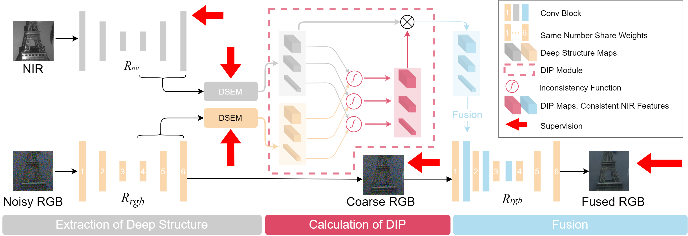

# DarkVisionNet: Low-Light Imaging via RGB-NIR Fusion with Deep Inconsistency Prior (Under review)

[Paper](https://arxiv.org/abs/2303.06834)

## Abstract
---
> RGB-NIR Fusion is a promising method for low-light imaging. 
> However, high-intensity noise in low-light images amplifies the effect of structure inconsistency between RGB-NIR images, which fails existing algorithms. 
To handle this, we propose a new RGB-NIR fusion algorithm called Dark Vision Net (DVN) with two technical novelties: Deep Structure and Deep Inconsistency Prior (DIP). 
> The Deep Structure extracts clear structure details in deep multiscale feature space rather than raw input space, which is more robust to noisy inputs. 
Based on the deep structures from both RGB and NIR domains, we introduce the DIP to leverage the structure inconsistency to guide the fusion of RGB-NIR. 
Benefiting from this, the proposed DVN obtains high-quality low-light images without the visual artifacts. 
> We also propose a new dataset called Dark Vision Dataset (DVD), consisting of aligned RGB-NIR image pairs, as the first public RGB-NIR fusion benchmark. Quantitative and qualitative results on the proposed benchmark show that DVN significantly outperforms other comparison algorithms in PSNR and SSIM, especially in extremely low light conditions.

## Network Architecture
---


## Dataset Preparation
---
Please download the dataset from [link](https://drive.google.com/drive/folders/10FV0q_GAP4gjQUbQ78waezfyGO07AxlP?usp=share_link) first. 

Then, unzip the file into `Dataset` directory.
And the directory structure is organized as:

```
Dataset
├── DVD_train_raw
│     ├── RGB
│     ├── NIR
├── DVD_test
│     ├── RGB
│     ├── NIR
├── DVD_real
│     ├── RGB
│     ├── NIR
```

Finally, create the training patches for faster data loading by

`python generate_train_patches.py`

And the directory structure now is organized as:

```
Dataset
├── DVD_train_raw
│     ├── RGB
│     ├── NIR
├── DVD_train
│     ├── RGB
│     ├── NIR
├── DVD_test
│     ├── RGB
│     ├── NIR
├── DVD_real
│     ├── RGB
│     ├── NIR
```

## Train And Evaluation
---
```bash
git clone (*代码发布时补充*)
cd DVN

export PYTHONPATH="${PYTHONPATH}:./"
pip install requirements.txt

# For the AutoEncoder (i.e. the network AE that provides supervision signals for DSEM) training, 
# set MODEL.MODE in training.yml to `Recons`, and run:
python train.py

# After the AutoEncoder (i.e. AE) training, you can visualize the deep structure supervision signals of RGB/NIR by:
python visualization/view_edgedetect.py

# For the DVN training, 
# set MODEL.MODE in training.yml to `Fusion`, and run:
python train.py

# You can evaluate the performance of DVN by:
python test.py

# Or you can evaluate the performance of DVN by:
python test_real.py

# You can visualize the calculated DIP by run:
python visualization/view_dip.py
```

*[注：`test.py, test_real.py, visualization/view_dip.py, visualization/view_edgedetect.py` 中的`saveImgForVis` 函数可以改成用`supershow`进行可视化]*

## Acknowledgements
---
This repository is greatly inspired by [MPRNet](https://github.com/swz30/MPRNet).
